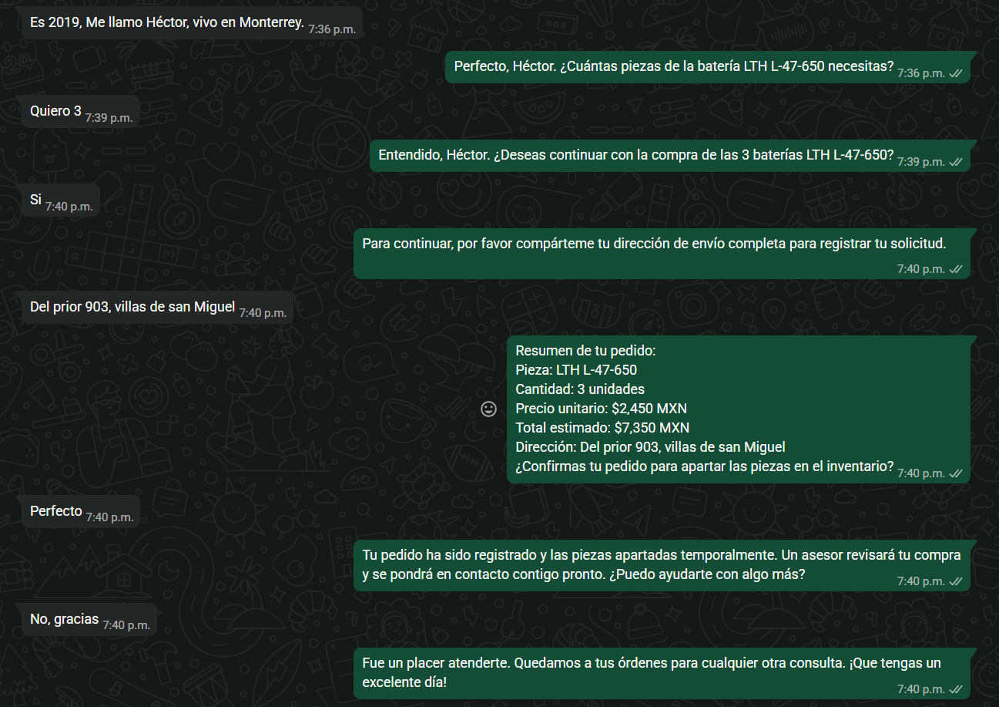
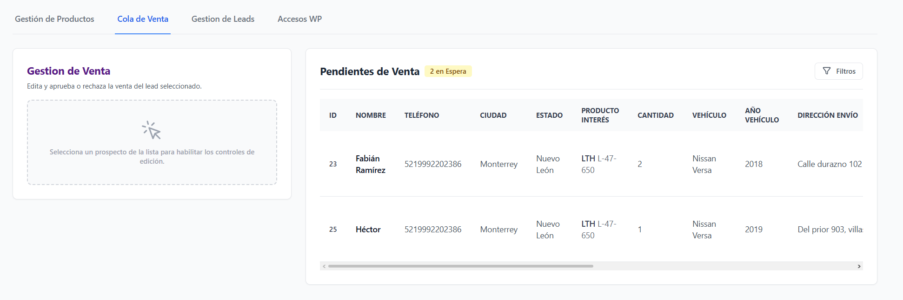
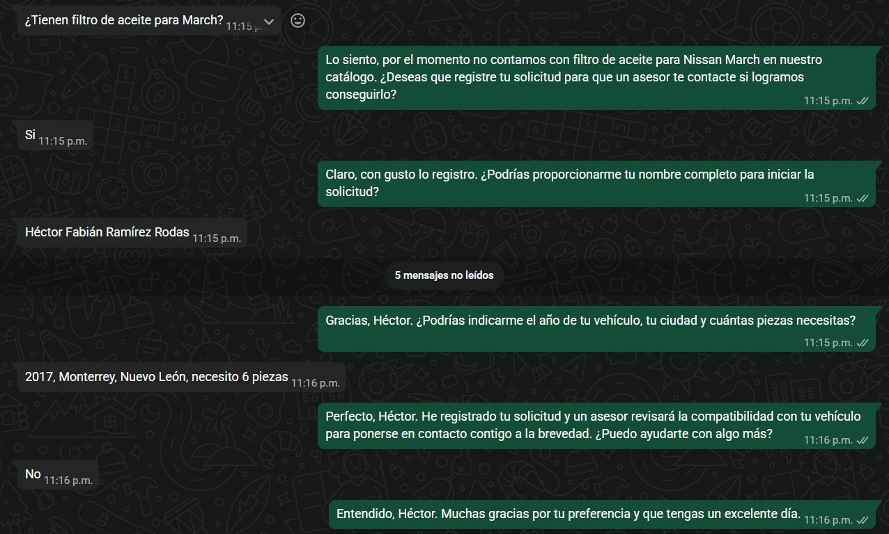

# Smart-Parts-Chatbot

Motor de chatbot empresarial que unifica IA conversacional con bases de datos relacionales. Automatiza la consulta de compatibilidades, disponibilidad y especificaciones técnicas de componentes en tiempo real, optimizando el embudo de captación de clientes.

---

## Tabla de Contenidos

1. [Arquitectura del Sistema](#1-arquitectura-del-sistema)
2. [Decisiones Técnicas y Cuestionamientos](#2-decisiones-técnicas-y-cuestionamientos)
3. [Fase 0: Registro de Riesgos](#3-fase-0-registro-de-riesgos)
4. [Stack Tecnológico](#4-stack-tecnológico)
5. [Estructura del Repositorio](#5-estructura-del-repositorio)
6. [Modelo LLM Utilizado](#6-modelo-llm-utilizado)
7. [Base de Datos](#7-base-de-datos)
8. [API REST](#8-api-rest)
9. [Workflows de n8n](#9-workflows-de-n8n)
10. [Chatbot de WhatsApp](#10-chatbot-de-whatsapp)
11. [Panel de Administración](#11-panel-de-administración)
12. [Cómo Probar el Sistema](#12-cómo-probar-el-sistema)
13. [Preguntas de Cierre](#13-preguntas-de-cierre)

---

## 1. Arquitectura del Sistema

El sistema está compuesto por cinco capas independientes que se comunican entre sí de forma desacoplada:

```
[WhatsApp]
    ↓ mensaje entrante
[Evolution API - CloudStation]
    ↓ webhook POST
[n8n Cloud - Workflow Chatbot]
    ↓ consulta
[Django REST API - Render]
    ↓ lee/escribe
[PostgreSQL - Render]

[Panel Web Django]
    ↓ aprueba/rechaza lead
[Evolution API]
    ↓ notifica resultado
[WhatsApp - Cliente]
```

### Separación determinista vs probabilística

| Capa | Tipo | Responsabilidad |
|---|---|---|
| PostgreSQL | Determinista | Fuente única de verdad: productos, leads, reservas |
| Django REST API | Determinista | Expone y protege los datos con lógica de negocio |
| n8n (ETL) | Determinista + IA | Extrae y estructura el catálogo desde texto en prosa |
| n8n (Chatbot) | IA con herramientas | Interpreta intención del cliente y orquesta el flujo |
| Gemini Flash | Probabilístico | Comprensión de lenguaje natural y generación de respuestas |
| Evolution API | Determinista | Canal de comunicación con WhatsApp |
| Panel Django | Determinista | Validación humana (asesor) antes de confirmar ventas |

La IA nunca opera sin supervisión sobre datos críticos. Toda información comercial (precios, stock, compatibilidad) proviene exclusivamente de la base de datos a través de la API, nunca del modelo.

---

## 2. Decisiones Técnicas y Cuestionamientos

### 2.1 El chatbot NO cierra ventas directamente

El documento original solicitaba que el chatbot pudiera "cerrar ventas sin intervención humana". Esta decisión fue rechazada por las siguientes razones técnicas y de negocio:

**Razón 1 — Riesgo de responsabilidad legal:** Un modelo probabilístico puede recomendar una refacción incorrecta basándose en compatibilidades generales. Si el cliente instala una pieza equivocada y sufre un accidente mecánico, la empresa queda expuesta a responsabilidades legales.

**Razón 2 — Confianza del cliente:** Un bot que "confirma" una venta sin validación humana genera una expectativa que puede romperse si la pieza no es compatible. Esto daña la reputación más que no cerrar la venta automáticamente.

**Razón 3 — Datos bancarios en WhatsApp:** Procesar pagos directamente en un canal conversacional es una violación a los estándares PCI DSS. Ningún dato financiero debe transitar por WhatsApp.

**Solución implementada:** El chatbot opera como un asesor de preventa. Captura la intención de compra, reserva el inventario temporalmente (TTL 15 minutos) y notifica a un asesor humano para validar la compatibilidad y confirmar la venta desde el panel web. El cliente es notificado del resultado vía WhatsApp directamente desde Django.

### 2.2 Dos workflows separados en n8n

Se optó por separar el workflow de ingesta de catálogo (ETL) del workflow del chatbot por las siguientes razones:

| Criterio | Workflow ETL | Workflow Chatbot |
|---|---|---|
| Disparo | Manual desde el panel | Automático por webhook |
| Tiempo de respuesta | No crítico (segundos/minutos) | Crítico (menos de 2 segundos) |
| Frecuencia | Ocasional | Continua |
| Si falla | Reintento manual | El cliente se queda sin respuesta |

Un fallo en la ingesta de catálogo no debe interrumpir las conversaciones activas con clientes, y viceversa.

### 2.3 Lista blanca de números autorizados

En lugar de responder a cualquier número que escriba al bot, se implementó una tabla `NumeroAutorizado` en la base de datos. Solo los números registrados en el panel pueden interactuar con el chatbot. Esto permite:

- Controlar quién puede usar el bot durante pruebas
- Evitar consumo innecesario de tokens de Gemini
- Escalar el acceso de forma controlada

### 2.4 Reserva temporal de inventario (Soft Allocation)

Se implementó un modelo `Reserva` con TTL de 15 minutos y protección contra condiciones de carrera usando `select_for_update()` de Django. Esto garantiza que si dos clientes quieren el mismo producto simultáneamente, solo uno puede reservarlo. El segundo recibe una respuesta honesta de stock insuficiente.

### 2.5 Auditoría de datos con timestamps

Aunque el documento original solo pedía `created_at` para leads, se incluyó `created_at` y `updated_at` en el modelo `Producto`. En un sistema de inventario real es crítico saber cuándo se actualizó un precio o un stock para detectar datos obsoletos y medir tiempos de respuesta del equipo de gestión.

### 2.6 Búsqueda tolerante a acentos

El motor de búsqueda de la API implementa un fallback de normalización de texto. Si la búsqueda estándar no arroja resultados (por ejemplo, "bateria" vs "Batería"), el sistema normaliza ambos textos eliminando acentos antes de comparar. Esto evita que el bot informe incorrectamente que un producto no existe.

---

## 3. Fase 0: Registro de Riesgos

Antes de implementar cualquier línea de código se identificaron y mitigaron los siguientes riesgos arquitectónicos:

### Riesgo 1 — Responsabilidad y Seguridad Física (Liability)

**El riesgo:** Delegar a una IA probabilística la recomendación final de piezas críticas (balatas, componentes de motor) basándose en compatibilidades generales puede resultar en la entrega de refacciones incorrectas, causando devoluciones, mala experiencia del cliente y exposición a responsabilidades por daños mecánicos o accidentes.

**La solución implementada:** El sistema opera como un asesor de preventa. Toda venta requiere el "Visto Bueno" de un asesor humano desde el panel web antes de ser confirmada. El cliente siempre es informado de que la compatibilidad es general y debe ser validada.

### Riesgo 2 — Desacoplamiento Transaccional (PCI-Compliance)

**El riesgo:** Cerrar ventas por WhatsApp puede implicar la captura de datos de tarjetas de crédito en el flujo conversacional, violando los estándares PCI DSS de seguridad de datos de pago.

**La solución implementada:** El entorno conversacional está completamente aislado del entorno financiero. El chatbot únicamente captura la intención de compra y los datos de envío. El procesamiento de pago queda fuera del alcance del bot y es responsabilidad del asesor al confirmar la venta.

### Riesgo 3 — Integridad de Concurrencia (Race Conditions en Inventario)

**El riesgo:** Con stock limitado, múltiples clientes pueden iniciar la intención de compra simultáneamente causando sobreventa si el inventario solo se descuenta al confirmar el pago.

**La solución implementada:** Soft-allocation con TTL de 15 minutos. Al confirmar la intención de compra, el sistema bloquea las unidades en la base de datos usando transacciones atómicas (`select_for_update`). Si el pago no se confirma en 15 minutos, las unidades se liberan automáticamente. El `stock_disponible` se calcula dinámicamente descontando las reservas activas del stock total.

---

## 4. Stack Tecnológico

| Componente | Tecnología | Hosting |
|---|---|---|
| Backend y Panel Web | Django + Django REST Framework | Render |
| Base de datos | PostgreSQL | Render |
| Orquestador de flujos | n8n | n8n Cloud |
| Modelo de lenguaje | Gemini 1.5 Flash | Google AI Studio |
| Canal de WhatsApp | Evolution API | CloudStation |
| Frontend del panel | HTML + Tailwind CSS + JS vanilla | Render (mismo servidor) |

---

## 5. Estructura del Repositorio

```
Smart-Parts-Chatbot/
├── catalog/
│   ├── models.py          # Producto, Lead, Reserva, NumeroAutorizado
│   ├── serializers.py     # ProductoSerializer, LeadSerializer
│   ├── views.py           # ViewSets, confirmar_compra, panel_view
│   ├── webhooks.py        # Ingesta de catálogo, notificación Evolution API
│   └── urls.py            # Rutas de la API y panel
├── core/
│   └── urls.py            # URLs raíz del proyecto
├── templates/
│   ├── base.html
│   └── login/
│   └── panel/             # Templates del panel de administración
│       ├── index.html
│       └── components/    # Tablas, formularios, accesos 
├── n8n/
│   ├── chatbot-whatsapp.json   # Workflow del chatbot
│   └── etl-catalogo.json       # Workflow de ingesta de catálogo
├── .env.example           # Variables de entorno requeridas
├── requirements.txt
└── README.md
```

---

## 6. Modelo LLM Utilizado

### Modelo: Gemini 3.1 Flash (gemini-3.1-flash)

**¿Por qué se eligió?**

Para una prueba técnica con presupuesto controlado, Gemini 3.1 Flash ofrece el mejor balance entre capacidad y costo:

- Google AI Studio ofrece un tier gratuito de una buena cantidad RPM y tokens por día, suficiente para una demostración completa
- Ventana de contexto de 1 millón de tokens, ideal para conversaciones largas con historial completo
- Integración nativa en n8n sin configuración adicional
- Latencia baja, crítica para respuestas en tiempo real por WhatsApp

**¿En qué partes se aplicó?**

| Uso | Descripción |
|---|---|
| Chatbot conversacional | Interpreta mensajes del cliente, decide qué herramientas llamar y genera respuestas naturales |
| Ingesta de catálogo (ETL) | Extrae y estructura información de productos desde texto en prosa hacia JSON |

**Limitaciones detectadas:**

- Al ser un modelo probabilístico, puede ignorar instrucciones del System Prompt en conversaciones largas o con prompts ambiguos
- Tiende a "inventar" datos si no se le restringe explícitamente con herramientas que consulten la API
- El contexto de conversación se pierde si el Simple Memory supera el límite configurado
- En ocasiones llama a herramientas en orden incorrecto si el System Prompt no es suficientemente imperativo

**¿Cómo se evita que invente información técnica o comercial?**

Se implementaron cuatro capas de restricción:

1. **System Prompt imperativo:** La primera instrucción del prompt es llamar obligatoriamente a `consultar_productos` antes de responder cualquier cosa sobre refacciones
2. **Herramientas como única fuente:** El modelo no tiene acceso directo a precios ni stock. Solo puede obtenerlos llamando a la API a través de las tools configuradas en n8n
3. **Instrucción explícita de no inventar:** El System Prompt incluye `NUNCA inventes precios, stock ni compatibilidades` en sección de límites críticos
4. **Validación humana:** Aunque el modelo alucinara, ninguna venta se confirma sin que un asesor humano la valide desde el panel

---

## 7. Base de Datos

### Modelos principales

**Producto:** Almacena el catálogo de refacciones con campos de compatibilidad y especificaciones técnicas en formato JSONField para máxima flexibilidad en la ingesta desde IA.

**Lead:** Registro de clientes interesados. Incluye estado de aprobación del asesor, notificación enviada y referencia directa al producto de interés mediante ForeignKey.

**Reserva:** Implementa el soft-allocation de inventario. Cada reserva tiene un TTL de 15 minutos. El campo `stock_disponible` en Producto se calcula dinámicamente restando las reservas activas no expiradas del stock total, sin necesidad de un proceso de limpieza externo.

**NumeroAutorizado:** Lista blanca de números de WhatsApp que pueden interactuar con el chatbot. Administrada desde el panel web.

### Nota sobre la estructura

Para este MVP se optó por un modelo desnormalizado que agiliza la ingesta de la IA mediante un solo payload JSON. En una arquitectura de producción definitiva se separaría el maestro de artículos (Producto) del mapeo de almacenes (Inventario) para eliminar redundancia y aislar la gestión de precios y stock por ubicación geográfica.

### Variables de entorno requeridas

Crea un archivo `.env` basado en `.env.example`:

```
SECRET_KEY=
DEBUG=False
DATABASE_URL=
ALLOWED_HOSTS=
N8N_WEBHOOK_URL=
EVOLUTION_API_URL=
EVOLUTION_API_KEY=
EVOLUTION_INSTANCE=
```

---

## 8. API REST

La API está construida con Django REST Framework y expuesta en:

```
https://smart-parts-chatbot.onrender.com/api/
```

### Endpoints disponibles

| Método | Endpoint | Descripción |
|---|---|---|
| GET | `/api/productos/` | Lista todos los productos activos |
| GET | `/api/productos/?search=Versa` | Busca por marca, modelo, categoría, ciudad, estado o compatibilidad |
| POST | `/api/productos/` | Crea un producto (usado por el ETL de n8n) |
| GET | `/api/leads/` | Lista todos los leads activos |
| POST | `/api/leads/` | Crea un nuevo lead |
| PATCH | `/api/leads/{id}/` | Actualiza un lead existente |
| POST | `/api/confirmar-compra/` | Crea una reserva temporal de inventario |
| POST | `/api/webhook/n8n-catalog/` | Recibe el catálogo estructurado desde n8n ETL |
| POST | `/api/webhook/evolution/` | Recibe eventos de Evolution API |

### Búsqueda tolerante a acentos

El endpoint de productos implementa búsqueda con doble capa: primero consulta estándar con `icontains` sobre todos los campos incluyendo `compatibilidad_general` (JSONField), y si no hay resultados aplica normalización de texto eliminando acentos para una segunda búsqueda. Esto garantiza que `search=bateria` encuentre productos con categoría `Batería automotriz`.

---

## 9. Workflows de n8n

### Workflow 1 — ETL de Catálogo (`etl-catalogo.json`)

Procesa texto en prosa y lo convierte en registros estructurados en la base de datos.

```
Panel Django (texto en prosa)
    ↓ POST webhook
[n8n - Webhook trigger]
    ↓
[Gemini - Extrae JSON estructurado]
    ↓
[Code - Sanitiza y valida el batch]
    ↓ itera por cada producto
[HTTP Request - POST /api/productos/]
    ↓
[PostgreSQL - Registro persistido]
```

El flujo implementa throttling (dosificación de peticiones) para respetar los límites de la API gratuita de Gemini y evitar bloqueos por rate limit. Cada producto se inserta de forma atómica e independiente para que un fallo en uno no afecte al resto del batch.

### Workflow 2 — Chatbot WhatsApp (`chatbot-whatsapp.json`)

Atiende mensajes entrantes de WhatsApp en tiempo real.

```
[Evolution API - Mensaje entrante]
    ↓ webhook POST
[n8n - Webhook trigger]
    ↓
[Code - Extrae phone, texto, remoteJid]
    ↓
[PostgreSQL - Verifica lista blanca]
    ↓
[Merge - Combina datos]
    ↓
[IF - ¿skip? ¿autorizado?]
    ├── No autorizado → [NoOp]
    └── Autorizado →
        [AI Agent - Gemini]
            ├── Simple Memory (sesión por teléfono)
            ├── Tool: consultar_productos → GET /api/productos/
            ├── Tool: crear_lead → POST /api/leads/
            ├── Tool: actualizar_lead → PATCH /api/leads/{id}/
            └── Tool: confirmar_compra → POST /api/confirmar-compra/
                ↓
        [HTTP Request - Evolution API sendText]
            ↓
        [WhatsApp - Respuesta al cliente]
```

### Memoria conversacional

El AI Agent usa `Simple Memory` con el número de teléfono como Session ID. Cada cliente tiene su propia sesión de conversación independiente con una ventana de contexto de 10 mensajes. Esto garantiza que el bot recuerde los datos del cliente a lo largo de la conversación sin necesidad de que los repita en cada mensaje.

---

## 10. Chatbot de WhatsApp

### Flujo de conversación

El chatbot sigue un flujo estricto definido en el System Prompt:

1. **Consultar catálogo primero:** Antes de responder cualquier cosa, llama a `consultar_productos`
2. **Evaluar ambigüedad:** Si el cliente no mencionó el vehículo, pide los datos faltantes. Si hay resultados claros, presenta marca, modelo, precio, stock y ciudad
3. **Recopilar datos progresivamente:** Nombre, año del vehículo, ciudad/estado y cantidad de piezas, uno por mensaje
4. **Confirmar intención:** Pregunta si desea continuar con la compra
5. **Capturar dirección y crear lead:** Si quiere comprar, pide dirección y registra el lead
6. **Mostrar resumen y confirmar:** Presenta el resumen con total calculado y pide confirmación explícita
7. **Reservar inventario:** Solo tras confirmación explícita llama a `confirmar_compra`
8. **Notificar:** Informa que un asesor revisará y se pondrá en contacto

### Flujo de aprobación del asesor

```
Lead registrado en BD
    ↓
Asesor recibe alerta en el panel web
    ↓
Asesor valida compatibilidad y aprueba o rechaza
    ↓
Django llama directamente a Evolution API
    ↓
Cliente recibe notificación por WhatsApp
```

### Qué puede y no puede hacer el chatbot

| Puede | No puede |
|---|---|
| Consultar precios y stock desde la API | Inventar precios o compatibilidades |
| Capturar datos del cliente | Solicitar datos bancarios |
| Registrar leads | Confirmar ventas sin asesor |
| Reservar inventario temporalmente | Descontar stock definitivamente |
| Responder sobre refacciones | Hablar de temas ajenos al negocio |
| Informar sobre disponibilidad por ciudad | Garantizar compatibilidad |

---

## 11. Panel de Administración

El panel web de Django permite al equipo:

- **Gestión de Productos:** Agregar catálogo por ingesta en prosa (vía IA) o directamente con formulario estructurado
- **Cola de Venta:** Ver leads con intención de compra pendientes de validación
- **Gestión de Leads:** Historial completo de todos los leads, con filtros por estado
- **Accesos WP:** Administrar la lista blanca de números autorizados para el chatbot
- **Alertas:** Notificaciones de leads pendientes, stock crítico y leads incompletos

---

## 12. Cómo Probar el Sistema

### Credenciales de acceso al panel

```
URL: https://smart-parts-chatbot.onrender.com
Usuario: [proporcionado por separado]
Contraseña: [proporcionada por separado]
```

### Avisos importantes antes de probar

> **Servidor en hibernación:** El servidor de Render entra en modo de hibernación después de 15 minutos de inactividad. Si llevan más de 15 minutos sin acceder al panel, el primer request puede tardar hasta 60 segundos en responder mientras el servidor se reactiva. Esperen a que cargue antes de enviar mensajes de WhatsApp.

> **n8n Cloud:** El workflow de n8n también puede estar en modo inactivo. Por favor avisen al candidato antes de iniciar las pruebas para asegurarse de que los workflows estén activos.

> **Autorizar su número:** Para recibir respuestas del chatbot, deben agregar su número de WhatsApp a la lista blanca desde el panel en la pestaña "Accesos WP". El formato del número debe ser solo dígitos sin espacios ni guiones, incluyendo el código de país (ejemplo: `5218181234567` para México).

### Pasos para probar el chatbot

1. Ingresar al panel y agregar su número en "Accesos WP" con el prefijo 521
2. Avisar al candidato para verificar que n8n esté activo
3. Enviar un mensaje de WhatsApp al número de la refaccionaria (9616603311)
4. Seguir el flujo de conversación

### Casos de prueba sugeridos

**Caso 1 — Búsqueda general:**
```
Hola, busco una batería para un Versa.
```
Respuesta esperada: El bot consulta el catálogo y presenta la batería LTH L-47-650 con precio y stock, luego pide el año del vehículo y la ciudad.

*Chat del caso 1 propuesto*


**Caso 2 — Producto ambiguo:**
```
Necesito unas balatas.
```
Respuesta esperada: El bot pide modelo, año del vehículo y ciudad antes de mostrar productos.


**Caso 3 — Flujo completo de compra: (Propuesta propia)**
```
Seguir el flujo completo: buscar batería → dar datos → confirmar compra → dar dirección → confirmar pedido → verificar lead en el panel → aprobar desde el panel → verificar notificación en WhatsApp.
```

*Chat del caso 2 y 3 propuesto*


*Panel de aprobación de venta*

*Venta aprovada*

*Venta rechazada*


**Caso 4 - Producto ambiguo:**
```
Necesito unas balatas.
```
Respuesta esperada: Claro. Para ayudarte mejor, ¿me puedes compartir el modelo, año de tu vehículo y la ciudad donde te encuentras?

*Chat del caso 4 propuesto*

**Caso 5 - Producto fuera de catálogo:**
```
¿Tienen filtro de aceite para March?
```

*Chat del caso 5 propuesto*
Respuesta esperada: Por ahora no encontré filtros de aceite en el catálogo disponible. Puedo registrar tu solicitud para que un asesor la revise. ¿Me compartes tu nombre, ciudad y estado?


---

## 13. Preguntas de Cierre

### 1. ¿Qué riesgos existen si la IA recomienda compatibilidades incorrectas?

El riesgo principal es que el cliente instale una refacción incompatible con su vehículo. Esto puede causar daños mecánicos, accidentes y exposición legal para la empresa. Secundariamente genera devoluciones, pérdida de confianza y costos operativos.

Por eso el sistema implementa tres capas de protección: el chatbot siempre aclara que la compatibilidad es general y debe validarse, ninguna venta se confirma sin un asesor humano, y el cliente debe confirmar explícitamente el pedido antes de que se reserve el inventario.

### 2. ¿Qué información debería venir siempre desde la API y no desde el modelo?

Toda información comercial y técnica debe provenir exclusivamente de la API: precios, stock disponible, ubicación por ciudad, especificaciones técnicas, lista de compatibilidades y el ID del producto. El modelo de lenguaje solo debe interpretar la intención del cliente y generar respuestas naturales, nunca fabricar datos.

### 3. ¿Cómo evitarías que el chatbot invente datos?

Con cuatro mecanismos en simultáneo. Primero, un System Prompt imperativo que obliga al modelo a llamar a `consultar_productos` antes de mencionar cualquier dato. Segundo, las herramientas del AI Agent son la única forma de obtener información del catálogo, no hay datos en el prompt. Tercero, instrucciones explícitas de no inventar en la sección de límites críticos. Cuarto, validación humana obligatoria antes de confirmar cualquier venta, por lo que aunque el modelo alucinara en algún dato, el asesor lo detectaría antes de que el cliente lo reciba como definitivo.

### 4. ¿Cómo manejarías una conversación donde el cliente da información incompleta?

El chatbot está diseñado para recopilar datos progresivamente, pidiendo un dato a la vez de forma natural. Si el cliente no menciona el año del vehículo, el bot lo pide. Si no menciona la ciudad, la solicita. Si no dice cuántas piezas necesita, pregunta explícitamente. El lead se crea con los datos disponibles en ese momento y se actualiza conforme el cliente proporciona más información a lo largo de la conversación. El Simple Memory de n8n garantiza que el bot recuerde lo que ya se capturó sin pedirlo de nuevo.

### 5. ¿Qué partes de tu solución escalarían bien y cuáles habría que mejorar?

Escala bien la API de Django, que es stateless y puede replicarse horizontalmente. El modelo de reservas con TTL escala correctamente porque no requiere procesos externos de limpieza. La separación de workflows en n8n también escala al poder duplicar el workflow del chatbot para múltiples instancias.

Lo que habría que mejorar en escala: el Simple Memory de n8n almacena sesiones localmente y no persiste entre reinicios ni se comparte entre instancias. En producción debería reemplazarse por Redis o PostgreSQL como backend de memoria. El servidor de Render en tier gratuito hiberna, lo que no es aceptable en producción.

### 6. ¿Qué cambiarías si el catálogo tuviera 10,000 productos?

Primero, la búsqueda actual con `icontains` en PostgreSQL no escalaría bien con ese volumen. Implementaría búsqueda con índices de texto completo (`pg_trgm` o `tsvector` en PostgreSQL) o integraría un motor de búsqueda dedicado como Elasticsearch o Typesense. Segundo, el chatbot no debería recibir listas completas de productos, sino solo los más relevantes con paginación. Tercero, el ETL de ingesta por prosa necesitaría procesamiento paralelo con una cola de tareas como Celery para manejar lotes grandes. Cuarto, separaría el modelo de Producto del modelo de Inventario para normalizar datos por ubicación.

### 7. ¿Cómo explicarías al dueño de la empresa que un sistema con IA no es completamente determinista?

Le diría que la IA funciona como un empleado muy capaz pero que a veces improvisa. Igual que un vendedor nuevo puede equivocarse al citar un precio de memoria, la IA puede cometer errores si no consulta el sistema correcto. Por eso en este sistema la IA nunca actúa sola sobre información crítica: siempre consulta la base de datos antes de dar un precio, siempre requiere que un asesor apruebe cada venta, y siempre le aclara al cliente que la compatibilidad debe validarse. La IA hace el trabajo pesado de atender cientos de conversaciones simultáneas, pero las decisiones importantes las toma un humano. Es una herramienta de productividad con supervisión, no un sistema autónomo.

### 8. ¿Qué pruebas aplicarías para asegurar confiabilidad antes de usar el sistema con clientes reales?

**Pruebas funcionales:** Validar los cinco casos del documento original: búsqueda general, cliente que da datos, cliente que quiere comprar, producto ambiguo y producto fuera de catálogo. Verificar que cada flujo termine con el lead correcto en la base de datos.

**Casos límite:** Qué pasa si el cliente envía emojis, mensajes vacíos, texto en inglés, números muy largos o caracteres especiales. Qué pasa si el cliente interrumpe el flujo a mitad de la conversación. Qué pasa si dos clientes compran el mismo producto con stock 1 simultáneamente.

**Errores de integración:** Qué pasa si la API de Django está caída cuando el bot intenta consultar productos. Qué pasa si Evolution API no entrega el mensaje. Qué pasa si Gemini alcanza el rate limit.

**Alucinaciones de la IA:** Probar con preguntas diseñadas para provocar inventos: pedir precio sin contexto, preguntar por un modelo de auto inexistente, preguntar datos internos de la empresa. Verificar que el bot en todos los casos consulte la API o admita que no tiene el dato.

**Calidad de datos:** Verificar que el ETL de ingesta por prosa genere siempre JSON válido, que el campo `producto_interes` en los leads siempre sea un ID numérico y no un nombre, y que `stock_disponible` refleje correctamente las reservas activas.

**Trazabilidad:** Verificar que cada conversación genere un lead en la base de datos con el teléfono correcto, que las reservas se liberen automáticamente al expirar el TTL, y que las notificaciones de aprobación lleguen al número correcto.

### 9. Si tuvieras más tiempo, ¿qué mejoras implementarías?

**Corto plazo:** Reemplazar Simple Memory de n8n por Redis para persistencia de sesiones entre reinicios. Agregar reintentos automáticos en el envío de mensajes vía Evolution API. Implementar un número dedicado de WhatsApp Business en lugar del número personal para eliminar el riesgo de baneo.

**Mediano plazo:** Agregar un segundo canal de notificación (email) para el asesor cuando llega un lead nuevo. Implementar métricas de conversación: tiempo de respuesta, tasa de conversión de leads a ventas, productos más consultados. Migrar a la API oficial de WhatsApp Business de Meta para mayor estabilidad y cumplimiento de términos de servicio.

**Largo plazo:** Separar el modelo de Producto del modelo de Inventario para manejar múltiples ubicaciones con stock independiente. Implementar un motor de búsqueda semántica para que el bot pueda encontrar productos aunque el cliente use términos coloquiales o descripciones imprecisas. Integrar una pasarela de pago certificada (Stripe) para que el asesor pueda generar y enviar un link de pago seguro directamente desde el panel.

---

## Entregables

| # | Entregable | Ubicación |
|---|---|---|
| 1 | Workflow de n8n exportado | `/n8n/chatbot-whatsapp.json` y `/n8n/etl-catalogo.json` |
| 2 | Código de la API | `/catalog/views.py`, `/catalog/serializers.py`, `/catalog/urls.py` |
| 3 | Modelos de base de datos | `/catalog/models.py` |
| 4 | Ejemplo del catálogo estructurado | Disponible en `GET /api/productos/` |
| 5 | Evidencia de conversaciones | Ver sección de screenshots (próximamente) |
| 6 | Registro de leads | Disponible en el panel y en `GET /api/leads/` |
| 7 | Documento de arquitectura | Este README |
| 8 | Preguntas de cierre | Sección 13 de este README |

---

*Desarrollado por Fabián Ramírez — Prueba Técnica Smart-Parts-Chatbot*
